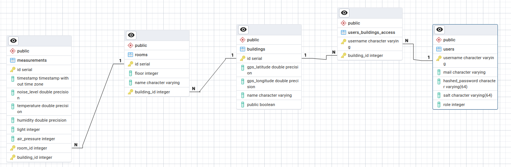
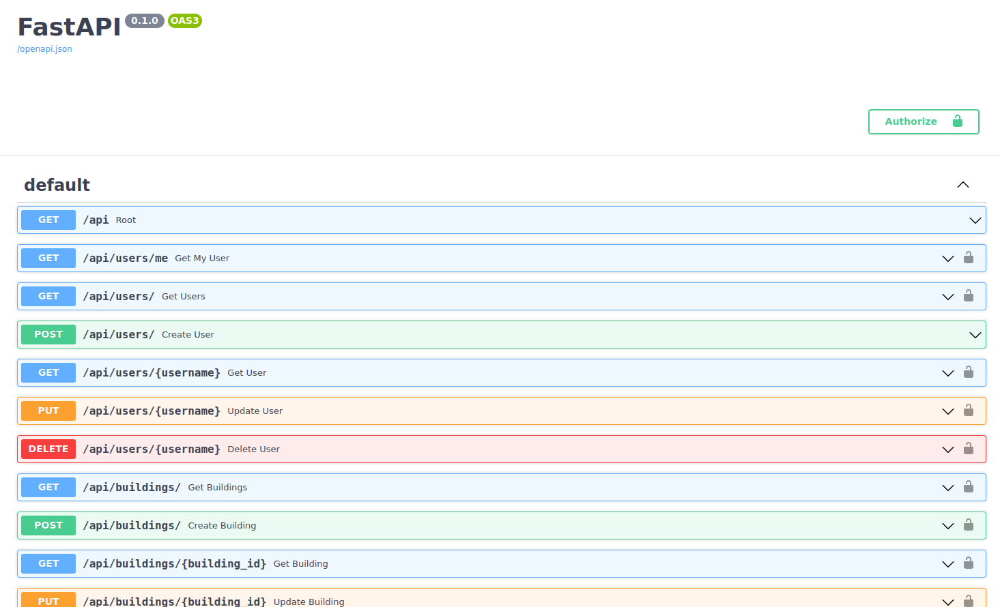
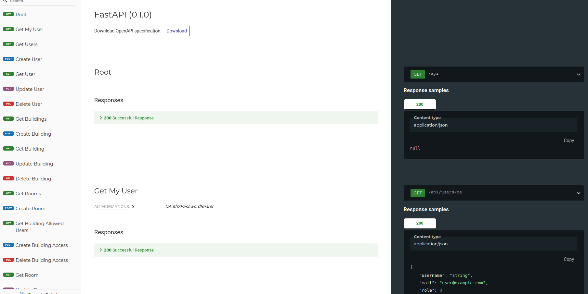
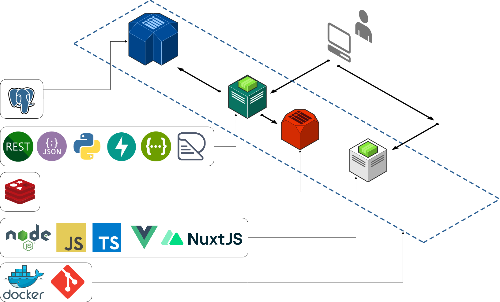
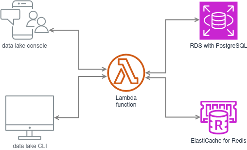
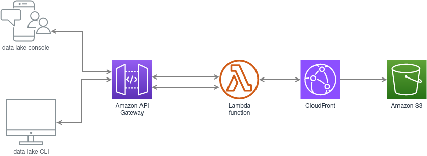

# Cloud buildings

A web application system on a NuxtJS webapp and a FastAPI Restful API, with multiple infrastructure deployments using Terraform. 

## Getting started

To just test the project with minimal configuration (if you have docker and docker-compose), just execute:
```bash
git clone https://github.com/AdrianVispalia/Cloud_Buildings
cd Cloud_Buildings
docker-compose build && docker-compose up -d
```

## Arquitecture

<details>

### Frontend (NuxtJS)

<details>

The front-end is created using NuxtJS, using the JavaScript web framework VueJS version 3. The code can later run on containers or FaaS services.

</details>

### Backend (FastAPI + PostgreSQL + Redis)

<details>

There are 3 micro-services that make the backend:
- Rest API: FastAPI with Python3 (with SQLAlchemy ORM)
- Database: PostgreSQL
- Cache: Redis

The database scheme can be represented with this Entity-Relationship diagram (generated automatically using pgAdmin):



Using FastAPI, the documentation is updated and available automatically with OpenAPI and Redoc:
| Category | OpenAPI (Swagger) | Redoc |
| - | - | - |
| Endpoint | *URL/docs* | *URL/redoc* |
| Image |  |  |

</details>

</details>


## Deployment

### Development (docker-compose)

<details>

#### Arquitecture schema



#### Create

```bash
docker-compose build && docker-compose up -d
```

#### Delete

```bash
docker-compose down
```

</details>

### Production

<details>

#### Backend deployment (1st step)

##### AWS with Lambda

<details>

#### Arquitecture schema



###### Create

```bash
cd rest_api

terraform init
terraform apply
```

###### Destroy

```bash
cd rest_api
terraform destroy
```

</details>

##### AWS with ECS & ECR

<details>

###### Create

```bash
cd rest_api

terraform init
# change aws_account_id with your account id
terraform apply -var "aws_account_id=$aws_account_id"
```

###### Destroy

```bash
cd rest_api
terraform destroy -var "aws_account_id=$aws_account_id"
```

</details>


#### Frontend deployment (2nd step)

<details>

##### Arquitecture schema




##### Create

```bash
cd ./frontend
npx nuxt build

sam validate
sam validate --lint

cd infrastructure/aws-lambda/step1
# read next 5 lines before executing sam deploy
sam deploy --guided
# during the deployment, after the S3 bucket is created
# but before CloudFront is deployed, run this:
aws s3 sync .output/public s3://<your_s3_bucket_name> --cache-control max-age=31536000 --delete

cd ../step2
# modify on /frontend/nuxt.config.ts cdnURL
npx nuxt build
sam deploy --guided --template-file step2.yaml
```


> For Lambda deployment, you will need to create an Internet Gateway & connect it to the VPC, and a routing table on that VPC with an entry 0.0.0.0/0 internet gateway. 
- Create EC2 in the same vpc (check assign public IP + create a security group in the VPC with port 22 open).
- Then select instance, Network, associate to RDS and choose the running RDS.
- Connect to the instance using Instance Connect (create an EIC endpoint). On the host:
```bash
scp -i "<key_pair>.pem" ~/Cloud_buildings/rest_api/code/utils/insert_db2.sql ubuntu@<EC2_IP>:/home/ubuntu
```
- Inside the created EC2 (you can connect using the AWS management console on the browser):
```bash
sudo apt-get install -y postgresql-client net-tools
ifconfig
psql -h my-db-instance.<string>.<region>.rds.amazonaws.com -U <user> -d <database> -a -f insert_db2.sql
```
- Now delete the EC2
> In lambda, delete as weel the routing table entry 0.0.0.0/0, the EIC endpoint and the internet gateway.


##### Delete

In the AWS console, go to the S3 bucket and delete all of the objects. Then:
```bash
cd /frontend/infrastructure/aws-lambda/step2
sam delete
cd ../step1
sam delete
```


</details>

</details>
